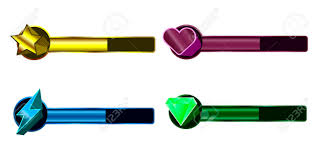
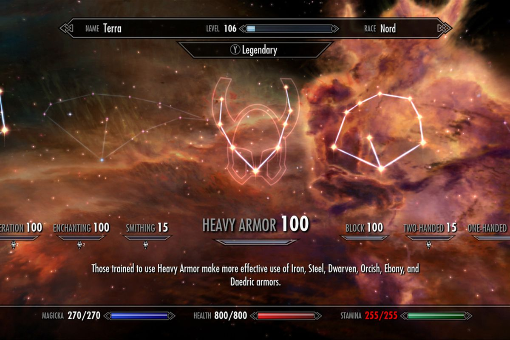
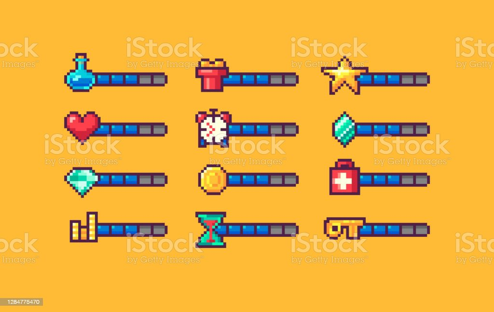
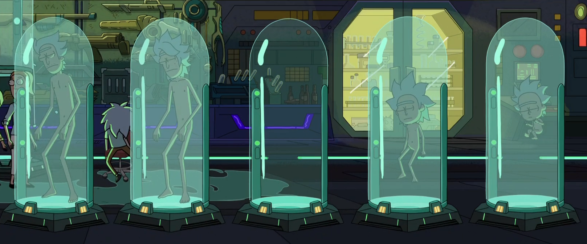

# DanielCastiblanco

This project was generated with [Angular CLI](https://github.com/angular/angular-cli) version 13.2.3.

# Structure Desing
## 1. Inicio/Home/¿Quién soy?
Una descripción de "Quién soy", Un listado de las habilidades tecnologicas que se muestren como barras de carga 

## 2. Portafolio/MyWork/Proyectos/
Una sala de experimentos que cada frasco tenga links de redirecciópn al los repositorios en github.

## 3. Certificados/Certificates/
>Certificados puede cambiar o ser eliminada con el tiempo. Pero por el momento un slider que muestre lso documentos.

## 4. Contacto/Contact/Formulario de contacto
Un formulario de contacto que contenga solo los campos de:
  * Nombre
  * Email
  * Asunto
  * Mensaje

úede tener este estilo de forumulario de videojuego en cuanto el trazo o bueno debe quedar general en toda la web

example_reference
